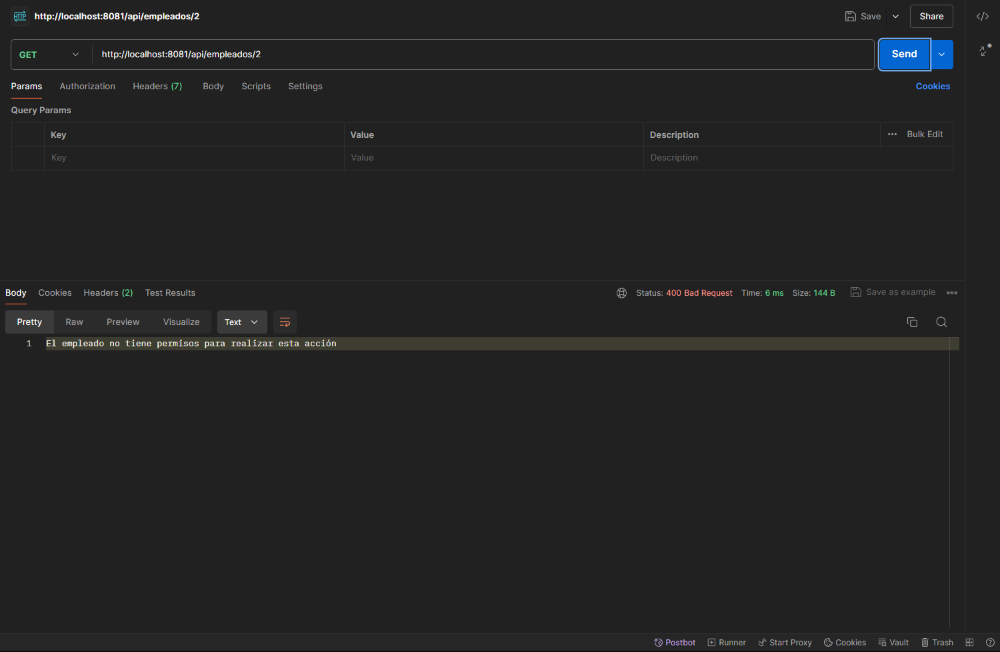
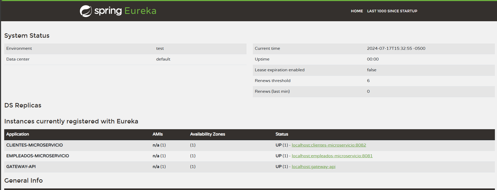

# DigitalSpace-PruebaTecnica

## Microservicio Clientes
Alojado en una base de datos no relacional (MongoDB) que contiene la información de 5 clientes por defecto y dispone de una API REST con los siguientes endpoints:

- **GET** /clientes: Devuelve la lista de clientes.
- **GET** /clientes/{id}: Devuelve un cliente por su id.

## Microservicio Empleados
Alojado en PostgreSQL con dos Tablas: Usuarios para obtener datos de Autenticación y Empleados para obtener datos de los empleados con una llave foránea de Usuarios.

Desde este microservicio según sea el cargo del empleado (ADMINISTRADOR/JEFE) se podrán acceder a los siguientes endpoints:

- **GET** http://localhost:8080/api/empleados/{id} siendo ID un empleado válido. Este endpoint se comunica con el microservicio de clientes para obtener la información de los clientes.

### Consulta Valida

### Consulta Denegada

## Gestion de Instancias con Eureka

## Dependencias utilizadas:

- Spring Data JPA
- PostgreSQL Driver
- Data MondoDB
- Spring WebFlux
- Spring Web
- Thymeleaf
- Spring Test
- Spring Security
- Spring Cloud Eureka Server
- Spring Cloud Eureka Client
- Lombok
- 
Microservicios
